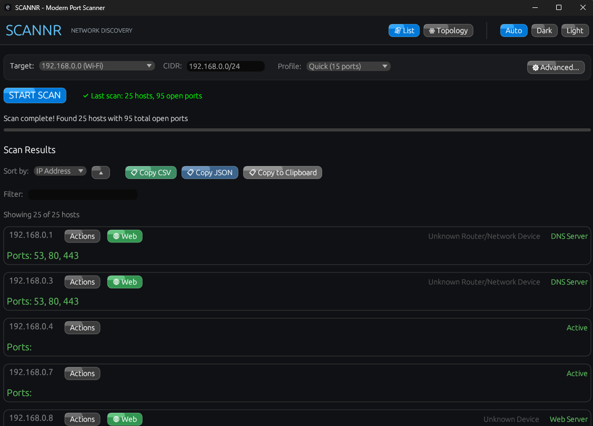
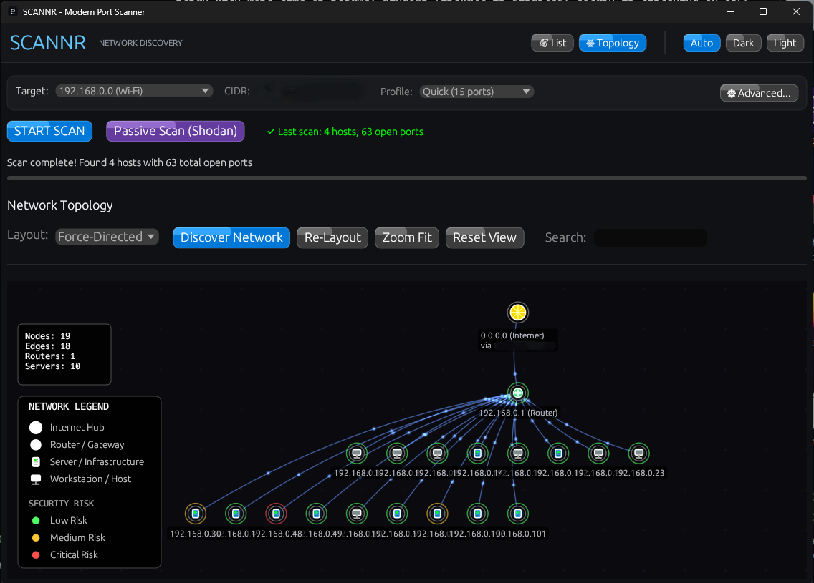

<div align="center" markdown="1">

# SCANNR
### The Modern GUI for RustScan

**Fast & Efficient.**


</div>

# What is SCANNR?

**SCANNR** is a high-performance, modern GUI and enhanced CLI suite built on top of the legendary [RustScan](https://github.com/RustScan/RustScan) engine. While maintaining the incredible speed of the original project, SCANNR adds a powerful graphical interface, real-time network visualization, and advanced discovery logic.

**Note:** SCANNR is an independent GUI project based on RustScan. We are deep admirers of the original work by the RustScan team and aim to provide a visual-first experience for their world-class scanning engine.

# Key Features

- **Extreme Speed:** Scans thousands of ports in seconds using the optimized RustScan engine.
- **Modern "Liquid Glass" GUI:** A stunning, responsive interface with subtle, premium visual effects and full Light/Dark mode support.
- **Passive Reconnaissance:** Automatically detects public subnets and offers a **Passive Scan** via Shodan InternetDB—no API key required. Get a hacker's-eye view of your external exposure silently.
- **SSH Terminal Integration:** Seamlessly hand-off discovered SSH hosts to your system's native terminal (CMD/PowerShell/Terminal) with pre-filled credentials.
- **Advanced Network Topology:**
    - **Interactive Map:** Visualize your network structure with router identification and device classification.
    - **Public IP Intelligence:** Automatically scans your public IP for open ports and services.
    - **Risk Visualization:** Devices pulse with color-coded rings (Green/Yellow/Red) indicating their security risk level based on open ports.
- **Cascade Scanning:**
    - **Phase 0:** Instant local neighbor discovery via ARP cache.
    - **Phase 0.5:** High-speed Active TCP Probe to force discovery of non-cached hosts.
    - **Phase 1:** Quick probing of common services.
    - **Phase 2:** Full deep-scan of all requested ports.
- **Vendor Identification:** Automatic MAC OUI lookup to identify device manufacturers (Apple, Cisco, Raspberry Pi, etc.).

# Screenshots

<div align="center">
  
  
</div>

# Installation

### Windows
1. Download the latest `scannr-gui.exe` or `scannr-cli.exe` from our [releases page](https://github.com/lazerusrm/SCANNR/releases).
2. Run and enjoy.

### macOS
1. Download the latest `scannr-gui` or `scannr-cli` from our [releases page](https://github.com/lazerusrm/SCANNR/releases).
2. Run and enjoy.

### Building from Source
Ensure you have the Rust toolchain installed, then:
```bash
git clone https://github.com/lazerusrm/SCANNR
cd SCANNR
cargo build --release
```
Binaries will be available in `target/release/`.

# Usage

### GUI Version
Launch `scannr-gui.exe`. Enter your target CIDR (e.g., `192.168.1.0/24`) and hit **Scan Network**. Results will appear in real-time as they are discovered.

### CLI Version
```bash
./scannr-cli -a 192.168.1.1/24 -t 500 -b 3000
```

# License & Attribution

SCANNR is licensed under the **GNU GPL-3.0**.

This project is a fork/extension of [RustScan](https://github.com/RustScan/RustScan). We owe a huge debt of gratitude to the original authors and contributors of RustScan for building the lightning-fast engine that powers this GUI. 

The original RustScan code remains the property of its respective owners and is used here in accordance with the GPL-3.0 license.

---
<div align="center">
  Made with love, SCANNR Responsibly.
</div>
